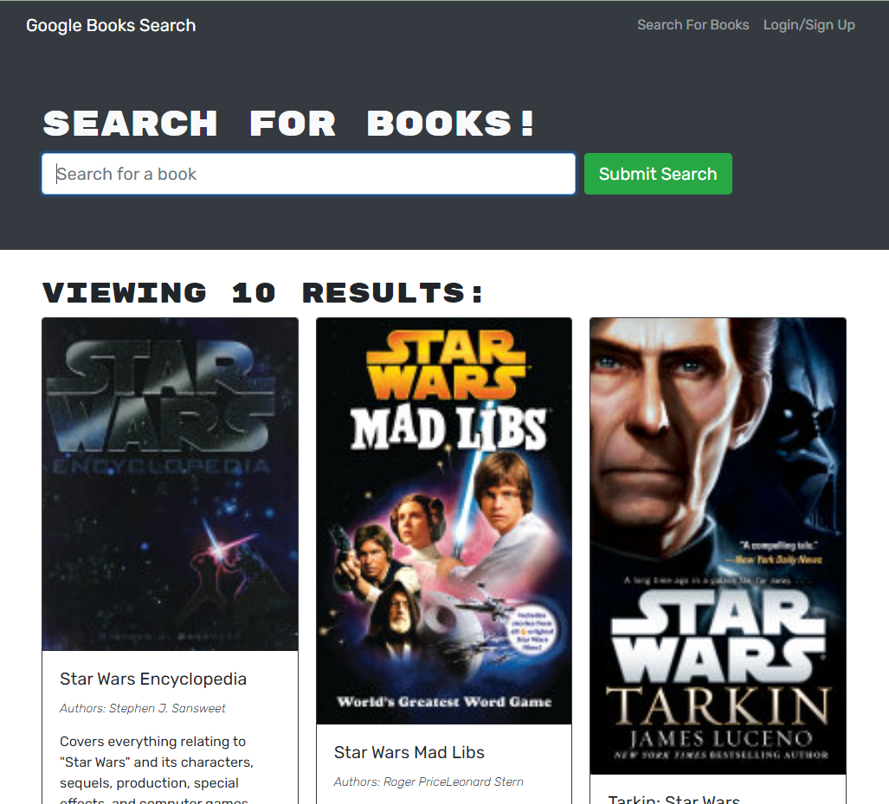

# **Book Search Engine**


## **Description**

This application is a Book Search Engine that's using the Google API to gather book data based on the input entered. You can also create an account to save books to your profile and while on your profile page you can remove those books from your account. This project's back-end uses a mix of Apollo, Express, graphQL and MongoDB and the front-end is primarly React. 

You can view the deployed application here: https://peaceful-peak-47455.herokuapp.com/

---

## **Table of Contents**

* [Preview](#preview)

* [Installation](#installation)

* [Usage](#usage)

* [License](#license)

* [Contributing](#contributing)

* [Questions](#questions)

---

## **Preview**



Deployed Application: https://peaceful-peak-47455.herokuapp.com/

## **Installation**

To run this app locally using the repo, you'll have to do the following.

To install the needed dependencies, run the following command:

```
npm i  
```

and then to run the app: 

```
npm run develop
```

---

## **Usage**

This product is free to use and can be modified as you see fit. If you want to contribute to this project directly, take a look at the [Contributing](#contributing) section. 

---

## **License**

This project is licensed under the MIT license.

---

## **Contributing**

You can contribute to this project by opening issues on the github repo or by emailing me directly at: justincodingclass@gmail.com

---

## **Questions**

If you have any questions about the project or repo, contact me directly at justincodingclass@gmail.com or open an issue on the repo. You can find my github profile with this project and others at [github.com/jwatkins28](https://github.com/jwatkins28/)
